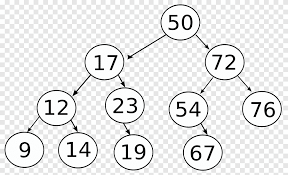
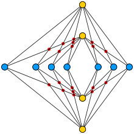

<H1>ARBOLES</H1>

<h3>Para saber si esto es un arbol verificamos que en su matriz digonal inferior solamente hay un 1 antes de la diagonal superior. 
  (si trabajamos con la diagonal superior, antes de la diagonal principal solamente tenemos un 1). si utilizamos la matriz diagonal inferior, trabajamos con filas.</h3>

Un arbol es un grafo, un grafo no es un arbol.

arbol binario, terciario, n ario.

con arboles podemos modelar moleculas, atomos. tienen conexiones, ligas.

tree/arbol hay una raiz(indica jerarquia), existe 1 solo camino entre 2 elementos.

*recorridos de un arbol 
--> + 3 2  = preorden
--> 3 + 2 = inorder
--> 3 2 + = posorder*

<ul>
<li>Árbol: Una estructura de datos no lineal compuesta por nodos interconectados. Se compone de un nodo raíz, nodos internos y nodos hoja.</li>

<li>Nodo: Un elemento individual en un árbol que contiene una pieza de información y enlaces a otros nodos.</li>

<li>Nodo raíz: El nodo superior del árbol, desde donde se inicia el recorrido del árbol. Un árbol solo puede tener un nodo raíz.</li>

<li>Nodo interno: Un nodo que tiene al menos un hijo. Es decir, un nodo que no es la raíz ni una hoja.</li>

<li>Nodo hoja: Un nodo que no tiene hijos, es decir, es un nodo terminal en el árbol.</li>

<li>Rama: Una secuencia de nodos conectados desde el nodo raíz hasta un nodo hoja.</li>

<li>Subárbol: Un árbol formado por un nodo y todos sus descendientes.</li>

<li>Grado de un nodo: El número de hijos que tiene un nodo en particular.</li>

Grado de un árbol: El grado máximo de todos los nodos del árbol.</li>

<li>Altura de un árbol: La longitud máxima del camino desde el nodo raíz hasta cualquier nodo hoja en el árbol.</li>
</ul>

**Árbol binario:** Un tipo de árbol en el que cada nodo tiene como máximo dos hijos: un hijo izquierdo y un hijo derecho.

**Árbol binario de búsqueda (BST):** Un árbol binario en el que para cada nodo, todos los nodos en el subárbol izquierdo son menores que el nodo actual, y todos los nodos en el subárbol derecho son mayores que el nodo actual.

**Recorrido en orden (in-order traversal):** Un algoritmo de recorrido de un árbol binario que visita los nodos en el siguiente orden: primero el subárbol izquierdo, luego el nodo actual y finalmente el subárbol derecho.

**Recorrido en preorden (pre-order traversal):** Un algoritmo de recorrido de un árbol binario que visita los nodos en el siguiente orden: primero el nodo actual, luego el subárbol izquierdo y finalmente el subárbol derecho.

**Recorrido en postorden (post-order traversal):** Un algoritmo de recorrido de un árbol binario que visita los nodos en el siguiente orden: primero el subárbol izquierdo, luego el subárbol derecho y finalmente el nodo actual.

<H1>graph/grafos</H1> 

existen 2 o más caminos entre un punto y otro.

**Grafo:** Una estructura de datos no lineal compuesta por un conjunto de nodos (vértices) interconectados mediante aristas.

**Nodo (vértice):** Un elemento individual en un grafo que representa un punto o una entidad. Puede tener asociada una etiqueta o un valor.

**Arista:** Una conexión entre dos nodos en un grafo que representa una relación o una conexión entre los elementos que los nodos representan.

**Grafo dirigido:** Un grafo en el que las aristas tienen un sentido dirigido, a diferencia del **GRAFO NO DIRIGIDO**, en el cual las aristas son relaciones simétricas y no apuntan en ningún sentido. 

**Sin dirección
es simetrica, diagonal nula y matriz cuadrada
la matriz es una raiz cuadrada de 5**

